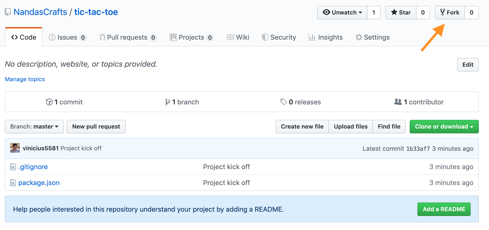
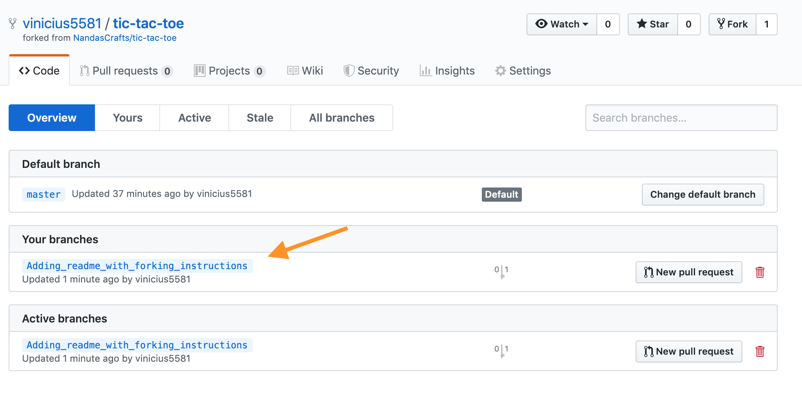

### Forking the GitHub Repository and Using Pull Requests


- Project owner
  - Create main repo (upstream)


- Project collaborators

  FORK > SYNC > BRANCH > COMMIT > PUSH > PULL REQUEST

  - Fork the repo

    In Github, navigate to the repository to be forked and select “Fork” on the upper right. Select your own user name when prompted. This creates a copy of the repository for you on Github.

    
    
    

  - Clone the forked repo
    ```
    git clone https://github.com/yourusername/tic-tac-toe tic-tac-toe-fork
    ```

    
    
  - Connect your Fork to the Master

    ```
    cd fork_path/tic-tac-toe-fork
    git remote -v
    ```

    

    
    
    ```
    git remote add upstream git@github.com:NandasCrafts/tic-tac-toe.git
    git remote -v
    ```
    

  - Syncing Your Fork

    ```
    cd fork_path/tic-tac-toe-fork
    git fetch upstream
    git checkout master
    git merge upstream/master
    ```

  - Branch Your Fork

    ```
    git checkout -b name_of_your_new_branch
    ```
  - Committing Changes to Your Fork
    ```
    git status
    git add path/file_name
    git commit -m “commit description”
    ```
  - Pushing Your Changes to GitHub (Your fork)
    ```
    git push origin name_of_your_new_branch
    ```
    
    

  - Making a Pull Request (To the master branch on the original repo)
    https://help.github.com/en/articles/about-pull-requests

    
    
  
  - Update a Pull Request
    https://www.burntfen.com/2015-10-30/how-to-amend-a-commit-on-a-github-pull-request

  - Merge a Pull Request
    

sources:
https://help.github.com/en/articles/working-with-forks
https://drupal.gatech.edu/handbook/using-pull-requests-forks